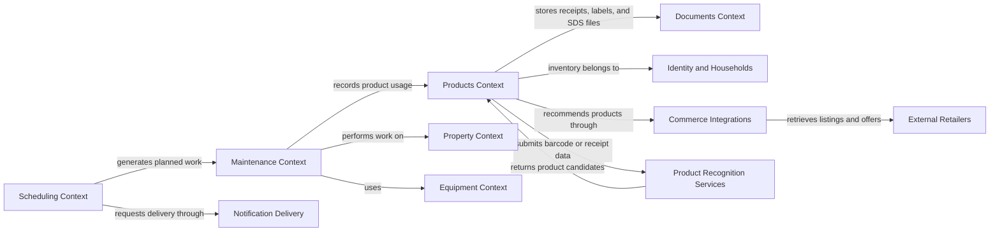

# PropertyOps Context Map

## Notes

The Products context is shared across property-maintenance domains. Lawn care,
cleaning, painting, automotive care, and equipment maintenance may all reference
the same product catalog and inventory capabilities.

Scheduling owns maintenance timing and generated occurrences. External calendar,
email, SMS, and push services are delivery adapters; they do not own maintenance
plans or scheduling rules.
