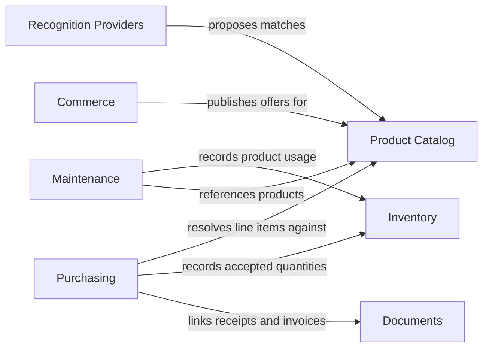

# Products Domain

## Purpose

The Products domain manages the identity, classification, acquisition, storage,
availability, use, and commercial discovery of products used to operate and
maintain a property.

Products may include:

- fertilizers
- herbicides
- pesticides
- cleaners
- paint and coatings
- replacement parts
- filters
- batteries
- grass seed
- maintenance supplies
- other consumable or reusable goods

## Domain Boundaries

The Products domain owns:

- product catalog records
- product identifiers
- package definitions
- inventory lots
- inventory transactions
- purchase records
- product usage
- storage assignments
- reorder recommendations

The Products domain does not own:

- maintenance task scheduling
- property areas and assets
- payment processing
- retailer fulfillment
- advertising attribution

Those capabilities integrate with the Products domain through explicit
relationships and domain events.

## Subdomains

| Subdomain | Responsibility |
|-----------|----------------|
| Product Catalog | Defines what a product is |
| Inventory | Tracks what the user currently possesses |
| Purchasing | Records how products were acquired |
| Usage | Records how products were consumed or applied |
| Product Discovery | Helps users find suitable products |
| Commerce | Connects products to stores and affiliate offers |

## Domain Documents

- [Product Catalog](product-catalog.md)
- [Inventory](inventory.md)
- [Purchasing and Product Acquisition](purchasing.md)
- [Commerce](commerce.md)

## Context Relationships

The catalog identifies products. Purchasing records acquisition. Inventory
tracks possession. Commerce offers optional ways to obtain products. These
responsibilities remain separate even when a single user workflow crosses all
four subdomains.

## Related Decisions

- [ADR-0002: Event-Driven Product Inventory](../../adr/adr-0002-event-driven-product-lifecycle.md)

## Open Questions

- Is Products one bounded context with internal subdomains, or will Catalog,
  Inventory, Purchasing, and Commerce become separate bounded contexts?
- Which product metadata is global, household-owned, or provider-owned?
- How are corrections to shared catalog records reviewed and published?
- Which regulatory and safety records require jurisdictional versioning?
