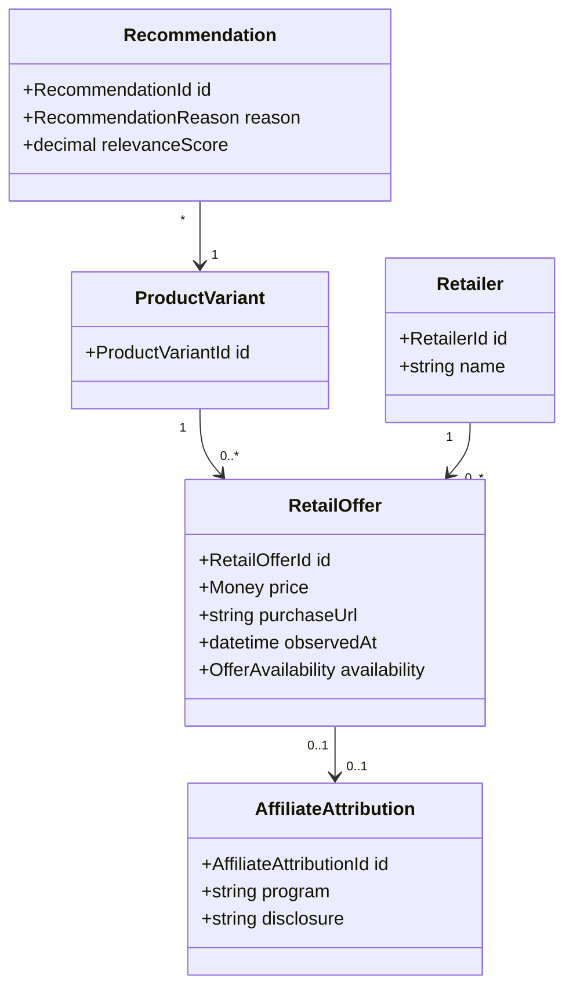

# Commerce Domain Model

## Purpose

Commerce connects catalog products and user needs with external purchasing
options.

Commerce is optional. Core product, maintenance, and inventory functionality
must remain usable without affiliate participation.

## Principles

- Recommendations must prioritize user relevance over commission.
- Affiliate relationships must be disclosed.
- Sponsored placement must be visibly distinguished.
- Users should be able to choose preferred retailers.
- Purchase and inventory data must not be sold without explicit consent.
- The catalog must not depend on a single retailer's identifiers.

## Conceptual Model

## Boundary Rule

A `RetailOffer` is not a product and is not inventory.

It is a time-sensitive commercial representation of where a product may be
purchased.

## Business Rules

- Core product, inventory, and maintenance functions do not require a retailer
  or affiliate relationship.
- Recommendation ranking prioritizes user relevance, compatibility,
  availability, and preference before compensation.
- Sponsored placement and affiliate attribution are disclosed at the point of
  recommendation.
- Retailer identifiers do not become canonical catalog identifiers.
- Prices and availability are time-stamped observations, not permanent product
  attributes.
- A user may choose preferred or excluded retailers.

## Domain Events

- `RetailOfferObserved`
- `RetailOfferExpired`
- `ProductRecommended`
- `AffiliateLinkPresented`
- `PurchaseIntentRecorded`

## Open Questions

- Which recommendation explanations must be retained for audit and trust?
- How should local retailers and service providers participate?
- Is a PropertyOps storefront an external commerce adapter or a separate bounded
  context?
- Which purchase-intent data may be retained, and under what consent policy?

## Related Documents

- [Product Catalog Domain Model](product-catalog.md)
- [Purchasing Domain Model](purchasing.md)
- [Product Principles](../../../principles.md)
