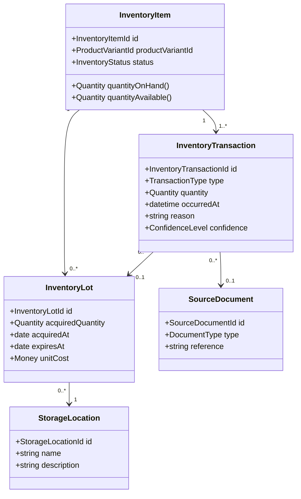
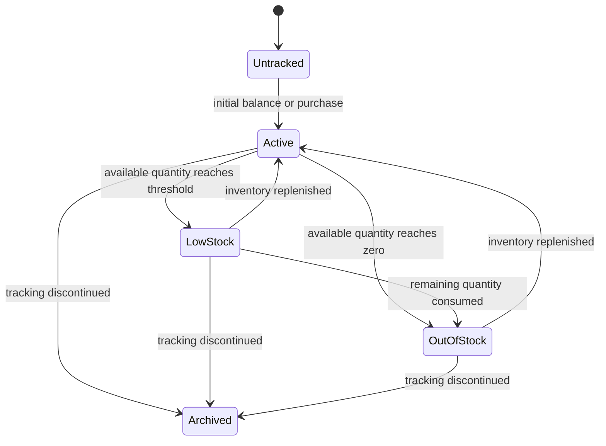

# Inventory Domain Model

## Purpose

Inventory represents products currently possessed by a household or property
organization.

Inventory is derived from transactions. Users may view the current quantity,
but the system records a transaction whenever that quantity changes.

## Core Invariant

> Inventory quantity is the result of accepted inventory transactions, not an
> independently edited counter.

## Ubiquitous Language

| Term | Definition |
|------|------------|
| Inventory Item | The household's tracked relationship with a product variant |
| Inventory Lot | A quantity acquired together with shared purchase or expiration data |
| Inventory Transaction | An event that increases, decreases, or reconciles inventory |
| Adjustment | A correction made after a physical count or discovered discrepancy |
| Reservation | Quantity expected to be used by planned work |
| Inventory Confidence | An indication of how reliable the calculated quantity is |
| Storage Location | The physical place where inventory is kept |

## Conceptual Model

## Transaction Types

- purchase received
- usage recorded
- returned
- disposed
- expired
- transferred in
- transferred out
- count adjustment
- initial balance

## Business Rules

- Transactions use explicit quantities and units of measure.
- A transaction that consumes more than the available quantity must follow a
  defined negative-inventory or reconciliation policy.
- Reservations reduce available quantity but do not reduce quantity on hand.
- Expiration, disposal, and return actions preserve the affected lot when it is
  known.
- Estimated transactions record their confidence and can be reconciled by a
  later physical count.
- Corrections append an adjustment or compensating transaction rather than
  rewriting accepted history.

## Inventory Lifecycle

## Calculation Notes

The exact projection strategy remains an implementation decision. The system may
store a calculated snapshot for performance, but the accepted transaction
history remains the authoritative record.

## Domain Events

- `InventoryInitialized`
- `PurchaseReceived`
- `ProductUsageRecorded`
- `InventoryReserved`
- `InventoryReservationReleased`
- `ProductReturned`
- `ProductDisposed`
- `ProductExpired`
- `InventoryTransferred`
- `InventoryCountAdjusted`
- `LowStockDetected`
- `OutOfStockDetected`

## Open Questions

- Is an `InventoryItem` owned by a household, a property, or another
  organization?
- Should inventory be tracked at package, variant, or both levels?
- How are partial packages and mixed units normalized?
- When may high-confidence inferred usage be accepted without explicit user
  confirmation?
- How should concurrent offline adjustments be reconciled?

## Related Documents

- [ADR-0002: Event-Driven Product Inventory](../../adr/adr-0002-event-driven-product-lifecycle.md)
- [Product Catalog Domain Model](product-catalog.md)
- [Purchasing Domain Model](purchasing.md)
