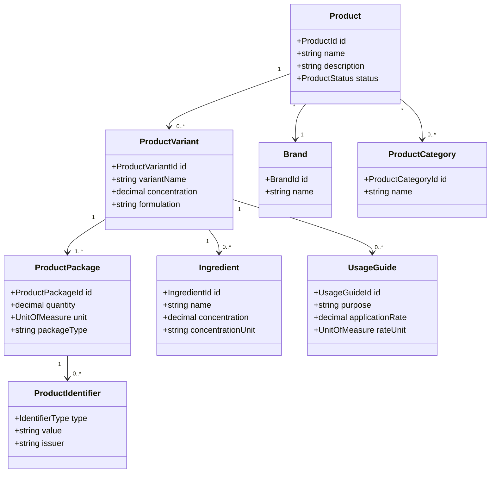

# Product Catalog Domain Model

## Purpose

The Product Catalog defines reusable product information independently from a
specific purchase, package on a shelf, or retailer listing.

A catalog product answers:

> What is this product?

An inventory lot answers:

> Which physical quantity of this product does the user possess?

## Ubiquitous Language

| Term | Definition |
|------|------------|
| Product | A recognizable good that can be purchased, stored, and used |
| Product Variant | A distinct formulation, size, concentration, or configuration |
| Package | A purchasable quantity and unit configuration |
| Identifier | A UPC, GTIN, retailer SKU, or manufacturer part number |
| Brand | The commercial identity under which a product is sold |
| Category | A classification used to organize products |
| Ingredient | A component relevant to usage, safety, or regulation |
| Usage Guide | Structured guidance for applying or consuming a product |

## Business Rules

- A product may have multiple variants.
- A variant may be sold in multiple package sizes.
- UPC and GTIN identifiers normally identify a package or variant, not an
  abstract product family.
- Retailer SKUs are scoped to a retailer.
- User-created catalog records must remain usable even when no external product
  match exists.
- AI or barcode matches must be confirmed when confidence is below an accepted
  threshold.

## Conceptual Model

## Aggregate Boundary

The initial aggregate root is `Product`.

Product variants, packages, and identifiers are maintained through the Product
aggregate unless scale or integration requirements later justify separating
them.

## Domain Events

- `ProductCreated`
- `ProductUpdated`
- `ProductVariantAdded`
- `ProductPackageAdded`
- `ProductIdentifierAssigned`
- `ProductMatchProposed`
- `ProductMatchConfirmed`
- `ProductDiscontinued`

Recognition providers propose catalog matches. They do not directly create
authoritative shared catalog records without the applicable confirmation or
review policy.

## Relationships

- Purchasing resolves purchase line items to `ProductPackage` records.
- Inventory tracks household quantities of a `ProductVariant` or
  `ProductPackage`.
- Commerce attaches retailer offers to catalog records without changing catalog
  identity.
- Documents stores labels, safety data sheets, and manufacturer literature.

## Open Questions

- Should user-created products and globally shared products use the same model?
- Can multiple users contribute corrections to shared product metadata?
- Which fields are authoritative when retailer and manufacturer data disagree?
- Should regulatory data be versioned by jurisdiction and effective date?

## Related Documents

- [Products Domain](README.md)
- [Inventory Domain Model](inventory.md)
- [Purchasing Domain Model](purchasing.md)
- [Commerce Domain Model](commerce.md)
