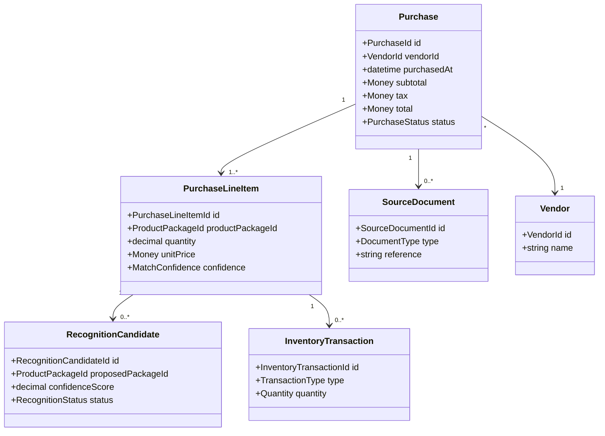
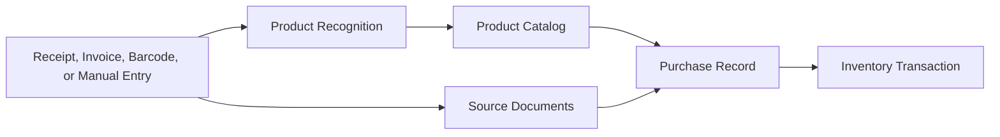
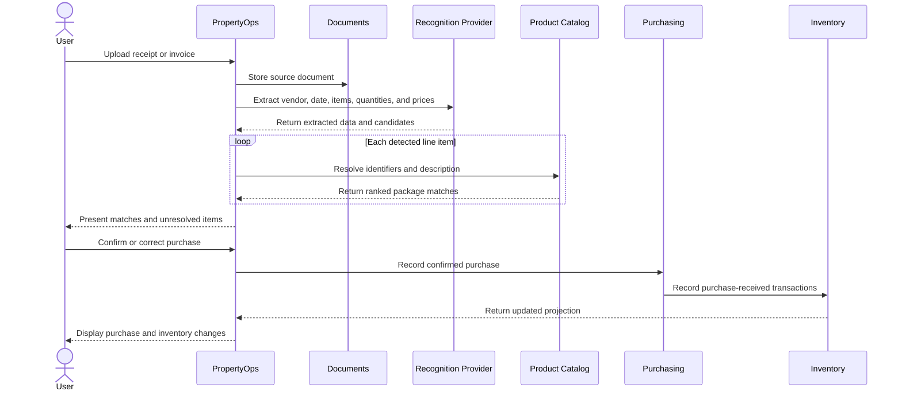

# Purchasing Domain Model

## Purpose

The Purchasing subdomain records how products are acquired and converts confirmed
purchases into inventory transactions.

It supports manual entry, barcode scanning, receipt recognition, invoice import,
returns, and future retailer integrations.

## Product Acquisition

Product acquisition is the workflow through which PropertyOps identifies a
purchased product, records its commercial details, and adds the resulting
quantity to inventory.

Acquisition may begin from:

- a manually entered purchase;
- a receipt or invoice upload;
- a barcode or UPC scan;
- a retailer order import;
- an initial count of products already owned; or
- a return, exchange, or transfer.

Scanning a barcode identifies a product but does not prove that a purchase
occurred. After recognition, the user may record a purchase, add existing
inventory, view product details, or add the product to a shopping list.

## Ubiquitous Language

| Term | Definition |
|------|------------|
| Purchase | A confirmed acquisition from a vendor |
| Purchase Line Item | A product package, quantity, and price within a purchase |
| Acquisition Source | Manual entry, barcode, receipt, invoice, retailer import, or transfer |
| Recognition Candidate | A proposed catalog match with evidence and confidence |
| Source Document | A receipt, invoice, order confirmation, or related record |
| Vendor | The party from which a product was acquired |
| Match Confirmation | User or policy acceptance of a recognition candidate |

## Responsibility Map

| Information | Owner |
|-------------|-------|
| Product name, brand, identifiers, and package size | Product Catalog |
| Vendor, price, tax, date, and line items | Purchasing |
| Quantity received and currently available | Inventory |
| Receipt image or invoice file | Documents |
| Current retailer listing or affiliate URL | Commerce |
| OCR, barcode lookup, and ranked match candidates | Recognition provider |

## Conceptual Model

## Acquisition Context Flow

## Receipt Import Workflow

## Business Rules

- Recognition results are proposals until accepted by the user or an approved
  confidence policy.
- The original source document remains linked to the confirmed purchase.
- Unknown products create draft catalog records instead of blocking unrelated
  line items.
- Duplicate source documents are detected before inventory transactions are
  committed.
- A confirmed purchase is immutable except through documented correction,
  return, or void workflows.
- Inventory receives transactions only after the relevant acquisition is
  confirmed.
- Commerce offers may assist purchasing, but they do not become purchase records
  until an acquisition is confirmed.

## Domain Events

- `PurchaseDrafted`
- `SourceDocumentAttached`
- `RecognitionCompleted`
- `PurchaseLineMatched`
- `PurchaseConfirmed`
- `PurchaseCorrected`
- `PurchaseVoided`
- `PurchaseReturned`

## Open Questions

- Which fields may be accepted automatically at different confidence levels?
- How are split receipts, coupons, tax, shipping, and package discounts
  allocated?
- How are retailer order updates and partial shipments represented?
- Does an initial inventory scan create a purchase, an initial-balance
  transaction, or both?
- How should household members resolve competing edits while offline?

## Related Documents

- [Product Catalog Domain Model](product-catalog.md)
- [Inventory Domain Model](inventory.md)
- [Commerce Domain Model](commerce.md)
